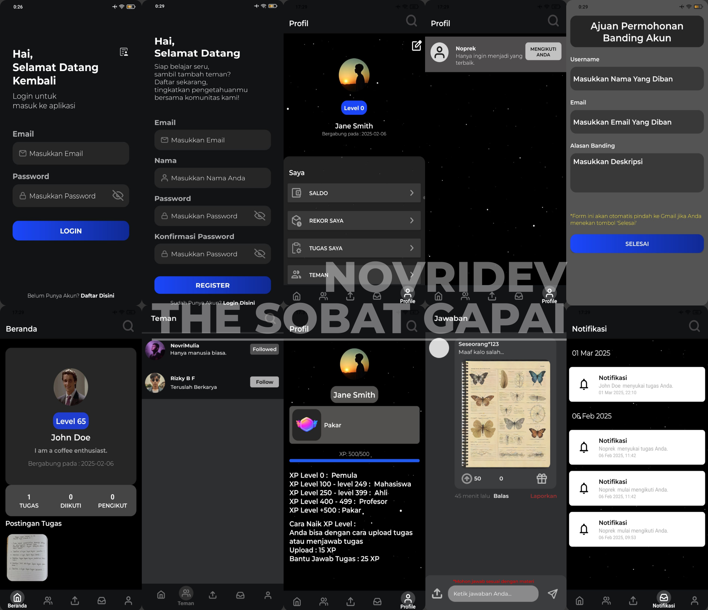

## <b> Preview Splash Screen </b> 

  <video width="500" controls>
  <source src="image/splashscreen.mp4" type="video/mp4">
</video>

 

## <b> Preview Project </b> 

  

## <b> Tentang Projek </b>  
<b><i>The Solusi Bantuan Tugas Gali Prestasi</i></b> adalah projek yang dimana bertemakan platform digital pendidikan, seperti halnya forum "The Sobat Gapai" ini sama halnya dengan aplikasi-aplikasi forum pendidikan lainnya namun mungkin  
yang berbeda. 
## <b> About the Project </b>  
<b><i>The Solusi Bantuan Tugas Gali Prestasi</i></b> is a project that has a digital education platform theme, like the "The Sobat Gapai" forum, this is the same as other educational forum applications but maybe  
different. 
## <b> Fitur-fitur Pengguna The Sobat Gapai </b> 
- Upload tugas. 
- Tambah pertemanan atau menerima pertemanan. 
- Pantau notifikasi. 
- Lihat profil akun orang lain.  
- Lihat jawaban tugas. 
- Menjawab tugas & mendapat xp untuk level. 
- Lihat riwayat level. 
- Ajuan permohonan banding akun. 
## <b> Fitur-fitur Admin The Sobat Gapai via Website </b> 
- Monitoring pengguna. 
- Ban pengguna. 
- Hapus tugas pengguna. 
- Hapus jawaban pengguna. 
## <b> The Sobat Gapai User Features </b> 
- Upload assignments. 
- Add or accept friends. 
- Monitor notifications. 
- View other people's account profiles. 
- View assignment answers. 
- Answer assignments & get xp for level. 
- View level history. 
- Submit account appeal requests. 
## <b> The Sobat Gapai Admin Features via Website </b> 
- User monitoring. 
- Ban users. 
- Delete user assignments. 
- Delete user answers. 
